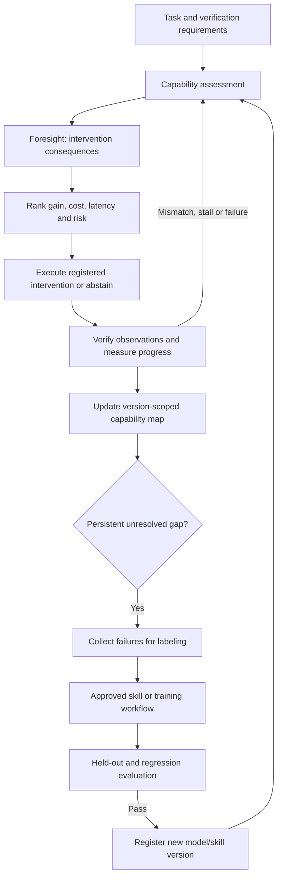

<p align="center"><strong>METACOGNISUM</strong></p>

<h1 align="center">Capability Gap Controller</h1>

<p align="center"><strong>Identify the gap. Choose the next step. Verify the gain.</strong></p>

<p align="center">
  Python 3.10+ &nbsp;·&nbsp;
  <a href="LICENSE">Apache-2.0</a> &nbsp;·&nbsp;
  <a href="CHANGELOG.md">v0.1.0a1</a>
</p>

<p align="center">
  <a href="#quick-start">Quick start</a> ·
  <a href="docs/architecture.md">Architecture</a> ·
  <a href="docs/integration.md">Integration</a> ·
  <a href="docs/evaluation.md">Evaluation</a>
</p>

---

The Capability Gap Controller assesses a task, uses the
[Foresight Agent](https://github.com/metacognisum/The-Foresight-Agent) to check
predicted consequences, and chooses among registered ways to improve the chance
of verified completion. Execution feeds a persistent capability map. Repeated,
unresolved failures can lead to a separately evaluated adaptation.

## The idea

> The controller diagnoses possible capability gaps; Foresight predicts the
> consequences of interventions that might close them.

This is a testable engineering hypothesis, not a claim that a model can reliably
know its own limits. A prediction guides selection; an independent evidence check
determines completion.



## Quick start

Foresight is a real package dependency, not a copied implementation. Neither
project is published to PyPI. With the repositories beside each other:

```bash
cd Capability-Gap-Controller
python3 -m venv .venv
source .venv/bin/activate
python -m pip install ../the-agents-rebuild .
capability-gap demo --output runs/demo-01
capability-gap inspect runs/demo-01/capabilities.sqlite3
```

On Windows, use `py` to create the environment and activate
`.venv\Scripts\Activate.ps1`. If your Foresight checkout has a different folder
name, adjust its installation path.

For a standalone checkout, install the pinned Foresight revision first:

```bash
python -m pip install "git+https://github.com/metacognisum/The-Foresight-Agent.git@f65a47163a2618f12f6cecbe586db40e9a49347f"
python -m pip install .
python -m capability_gap demo --output runs/demo-01
```

Installation needs the dependency source and may download build tools. After
installation, the demo runs offline without credentials or a model download.
The output directory must be new; previous results are never overwritten.

## What the executable demo does

| Scenario | Actual behavior |
| --- | --- |
| Simple addition | Direct solver completes in one step |
| Hidden multiplication limitation | Direct attempt fails; controller diagnoses again and selects a calculator |
| Missing information | Retrieval reads a local JSON reference and the answer is independently checked |
| Persistent conversion skill gap | Three distinct tasks each fail with two different remedies |
| Adaptation | A two-parameter arithmetic skill is fitted from three labeled examples |
| Evaluation | Three unseen conversions improve from 0/3 to 3/3; two addition regressions still pass |
| Reuse | The accepted skill solves another conversion under a new version identifier |

These are **scripted mechanism examples**, not LLM benchmark results. The arithmetic
skill is a fitted affine function, not LoRA or neural fine-tuning.

The output includes a SQLite map, per-run JSONL traces, a summary, six failure
records for labeling, an adaptation report, and the accepted skill artifact.
Raw failure records deliberately contain no fabricated “correct” training target.

## Intervention selection

For each available intervention `a`:

```text
gain(a)    = estimated P(verified completion after a) − estimated P(direct completion now)
utility(a) = gain(a) − cost_weight × cost
                    − latency_weight × latency
                    − risk_weight × risk
```

The policy filters unregistered handlers, missing approvals, excessive risk,
unaffordable actions and exhausted retries. Foresight rejects unsupported predicted
beliefs or decisions. The controller abstains when the best supported option falls
below a configurable utility threshold.

Task success, tool success, progress and actor confidence are separate fields.
Confidence alone can never satisfy the task verifier. The capability map adjusts
new task-success predictions with version- and task-family-specific selected
outcomes; it does not treat unexecuted interventions as observed counterfactuals.

## Implemented boundaries

| Capability | Status |
| --- | --- |
| Assessment and all requested gap categories | Typed interfaces; scripted provider and JSON model provider |
| Direct, retrieval, tool/API, compute, specialist, examples, human, skill, adapter, LoRA, fine-tune, abstain | Registered intervention vocabulary, filtering and ranking |
| Actual bundled handlers | Arithmetic solver, calculator and local retrieval; the compute demo intentionally cannot fix a missing skill |
| Foresight integration | Reuses forecast validation, evidence support checks and observation comparison |
| Recovery | Progress/outcome mismatches, stalls, tool failures and confidence drops trigger reassessment |
| Capability map and clusters | SQLite; model-version/task-family scope; exact failure-code grouping |
| Adaptation | Persistent-gap eligibility, approved collection, trainer interface, held-out/regression acceptance |
| Neural training, specialist services and human contact | Application-supplied integrations; no bundled training jobs or external messages |

Training selections return `adaptation_pending`; they cannot declare the original
task solved. Evaluation is a separate gate. Accepted artifacts must be registered
by the application as a new version. See [integration](docs/integration.md).

## Optional live model example

With Ollama already running and a model already installed:

```bash
python examples/live_arithmetic.py --model YOUR_MODEL --output runs/live-01
```

The model generates forecasts and can attempt the arithmetic task; a calculator
checks answers independently. The same model may serve both roles, with separate
calls. No live-model efficacy is claimed from the offline tests.

## Research limits

The controller's diagnoses are hypotheses. Authority, freshness, task families,
failure codes and verification rules come from the application. Exact structured
evidence is not a universal truth detector. Progress is the fraction of explicit
requirements supported, which may be coarse for long tasks.

Empirical prediction adjustment is a small-sample heuristic with selection bias,
not an estimate of causal capability gain. Cost units are application-defined;
prediction latency is counted, but model token cost is not automatically metered.
There is no sandbox, hard preemption, distributed scheduler or automated GPU
training service. The broader architecture overlaps with existing metareasoning
and agent-control ideas; this repository makes no research-priority claim.

## Development

```bash
python -m unittest discover -v
python -m capability_gap demo --output runs/check-01
git diff --check
```

[Contributing](CONTRIBUTING.md) · [Changelog](CHANGELOG.md) · [License](LICENSE)
